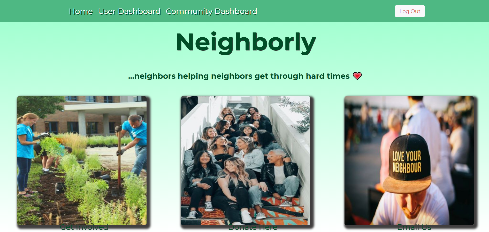
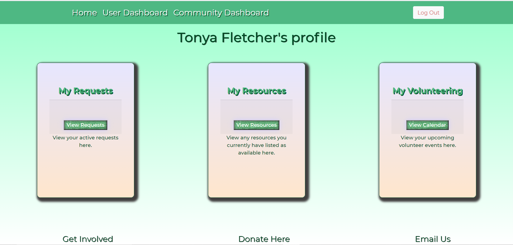
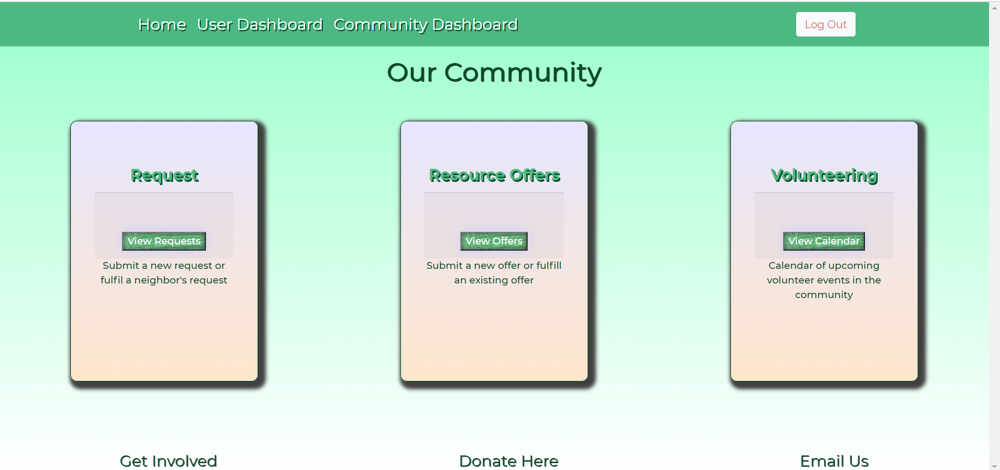

# Neighborly

## Description
This application is a full MERN stack application, what that means is it uses a combination of MongoDb for the database, Express for the server and middleware functionality, React to handle the view that the user sees on the front end and last but not least Node, which enables us to do Javascript tasks more easily inside VS Code. This abides by the MVC paradigm of model, view, controller, and that is exactly what a MERN stack is able to give you. Neighborly was no easy application to build, especially for us first time MERN stack developers. This was a mammoth undertaking and one that required a lot of patience and skill to accomplish. React enables us to pass in different components into the views so that they are more reusuable for future development and also moduralizes the code so you can seperate concerns more easily. For this application there is a total of 19 components and 19 views which play just a small part in making react work, that isn't counting all the routes and models that go into it as well. One of the biggest features that really pulled the whole app together was the use of Auth0. This is where we ran into our biggest challenges and successes as a team. Auth0 is used to securely authenticate users, and while doing this we were then able to keep track of what users were logged in at a given time. That allowed us to be able to have user specific profiles for each user and at the same time allowing them to view the community dashboard which pulled the info from all users to display them dynamically after a single user had entered the info. This all came together to make a mutual aid application, with a template style design, that can be implemented to any city or community across the country so that neighbors can help eachother out in times of need and more easily share resources and ask for help.

## Installation
To install this repo on your local drive you would have to clone the ssh key from my repo. Head into your local drive of choice in terminal or bash and do a git clone. Once you have done a git clone you are free to start working on this project. If you want to push your changes to my repo then you would have to head into terminal/bash and do a git add . Then a git commit -m explaning the changes made, and finally a git push to push the files onto the repo.

## Usage
If you want to use this program on the front end then simply click on the link in the finished project section of this read me. If you would like to tinker with the back-end, first do a git clone as previously described. Once you have the all the folders in your vs code, make sure you do a npm install in the command line to install all the dependencies listed in the package.json. Then go to the server.js file and check the port you are listening on and make sure you are able to spin up a localhost:[PORT NUM]. Go into the intergrated terminal and run the command npm start. This will spin up a local server enabling you to make changes in your editor of choice and see them in the browser. If you want to push up your own community mutual aid site to heroku make sure to follow this guide.

## Finished Project!
[Check out the deployed application on Heroku](https://intense-beyond-20958.herokuapp.com/)
[Watch the demo video](https://drive.google.com/file/d/1mgbvn__-zQ1R6NlPvMMYv4NBf61RpWWV/view?usp=sharing)

## License
MIT License

Copyright (c) [2021] [Tonya Fletcher]

Permission is hereby granted, free of charge, to any person obtaining a copy
of this software and associated documentation files (the "Software"), to deal
in the Software without restriction, including without limitation the rights
to use, copy, modify, merge, publish, distribute, sublicense, and/or sell
copies of the Software, and to permit persons to whom the Software is
furnished to do so, subject to the following conditions:

The above copyright notice and this permission notice shall be included in all
copies or substantial portions of the Software.

THE SOFTWARE IS PROVIDED "AS IS", WITHOUT WARRANTY OF ANY KIND, EXPRESS OR
IMPLIED, INCLUDING BUT NOT LIMITED TO THE WARRANTIES OF MERCHANTABILITY,
FITNESS FOR A PARTICULAR PURPOSE AND NONINFRINGEMENT. IN NO EVENT SHALL THE
AUTHORS OR COPYRIGHT HOLDERS BE LIABLE FOR ANY CLAIM, DAMAGES OR OTHER
LIABILITY, WHETHER IN AN ACTION OF CONTRACT, TORT OR OTHERWISE, ARISING FROM,
OUT OF OR IN CONNECTION WITH THE SOFTWARE OR THE USE OR OTHER DEALINGS IN THE
SOFTWARE.

## Badges

## Features
* Full MERN stack application.
* Every component on the page has its own file, lends itself to better reusablitiy.
* Laybout built using CSS Bootstrap.
* Seperate views for each page that have their own seperate routes for seperation of concerns.
* Uses Auth0 for login to have a more secure webiste
* With Auth0 we were able to render user specific information on each page and have user specific profiles.
* Used userContext.Provider to wrap the entire application so the user object was available everywhere.
* Databse powered by mongoDb.
* Feautures a mobile first design that responds to any viewport size.
* In the footer there are links to donate, email and get more info on mutual aid and why it is important.
* Site hosted live on Heroku!